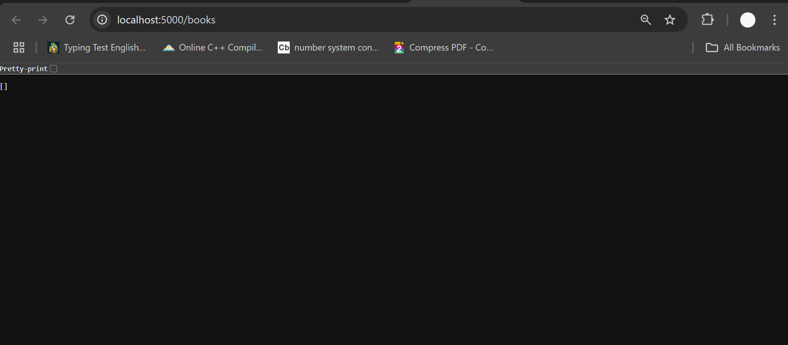
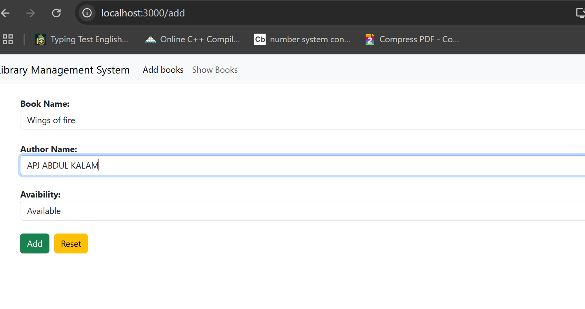
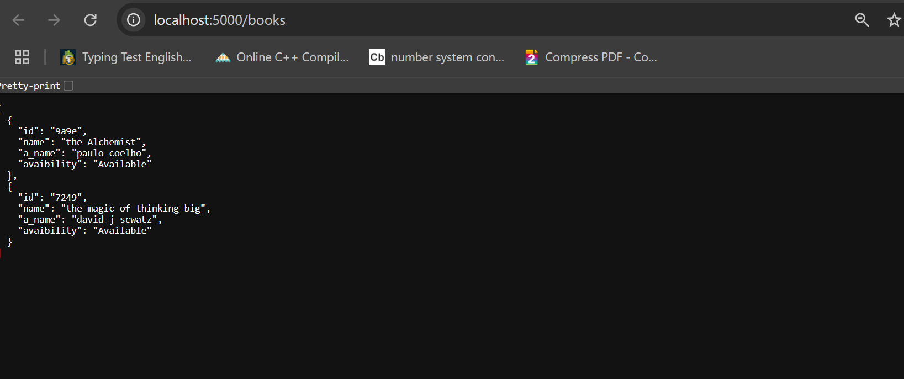
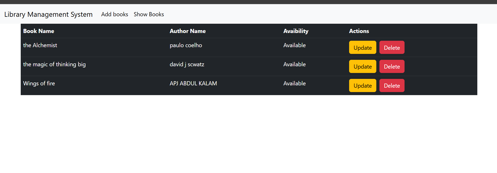

# BookVault The Library Management System

Welcome to **Library Management System**, a comprehensive solution for managing and organizing books within a library. The system allows users to perform CRUD (Create, Read, Update, Delete) operations on books, making it efficient and easy to maintain a library's book collection.

## Features

- **Add Books**: 
  - Users can add books to the library with details like title, author, and genre.
  
- **View Books**:
  - Users can view all the books in the library in a clean and organized manner.
  
- **Edit Books**:
  - Users can update book details such as title, author, and genre.
  
- **Delete Books**:
  - Users can delete books that are no longer needed.

- **Responsive Design**:
  - The system is fully responsive, ensuring a seamless experience on both desktop and mobile devices.

- **Backend**:
  - The system uses a mock backend API powered by `json-server` to simulate database interactions.

## Tech Stack

- **Frontend**:
  - React
  - Axios (for API requests)
  - React Router (for navigation between pages)
  - Bootstrap (for styling)

- **Backend**:
  - JSON Server (for mocking REST API)

- **Database**:
  - A mock database using `db.json` to store book details.

## Screenshots

Here are some screenshots showcasing the user interface of the Library Management System:

## Screenshots

Here are some screenshots showcasing the user interface of the Library Management System:

## Screenshots

Here are some screenshots showcasing the user interface of the Library Management System:

### Initial Database with No Books


### Added 1 Book: The Alchemist


### Interface: How to Add Books


### Updated Database After Adding 2 Books


### Database After Adding Wings of Fire



## Getting Started

Follow these steps to set up the project locally:

### Prerequisites

- Make sure you have Node.js and npm installed on your system.

### Installation

1. Clone the repository:
   ```bash
   git clone https://github.com/kaushlesh79/BookVault.git
  

2.Navigate into the project directory:
    ```bash

       cd .....\BookVault
   
3.Install dependencies for the frontend:
    
      cd ..\BooKVault
       npm run start-backend
    ```
4.Install dependencies for the backend:
    ```bash
    cd ../BookVault
    npm install
    ```
5.Start the backend server:
    ```bash
    
     npm start
    
6.Start the frontend server:
   ```bash
    cd ../frontend
    npm run start-backend
   ```


## Usage
  The frontend will be available at http://localhost:3000.
  The backend (mock API) will be available at http://localhost:5000.
  
  You can now interact with the library management system through the UI. Add, view, edit, and delete books, and see the changes reflected in 
  the mock backend.

### Contributing

1. Fork the repository.  
2. Create a new branch (git checkout -b feature/your-feature-name).  
3. Make your changes.  
4. Commit your changes (git commit -am 'Add new feature').  
5. Push to the branch (git push origin feature/your-feature-name).  
6. Create a new Pull Request.


